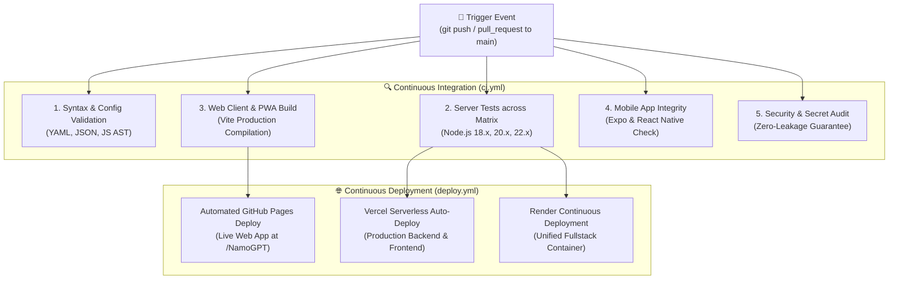

# 🔄 NamoGPT CI/CD Pipeline Documentation

> **Production-grade, automated Continuous Integration and Continuous Deployment (CI/CD) pipeline for NamoGPT using GitHub Actions.**

---

## 🏛️ Pipeline Architecture



---

## 🛠️ Workflows Included

### 1. `ci.yml` — Continuous Integration
Runs automatically on every `push` and `pull_request` to the `main` branch.

| Job Name | Steps Executed | Purpose |
| :--- | :--- | :--- |
| **🔍 Syntax & Config Validation** | Validates `config.yaml`, all `package.json` files, `app.json`, and verifies syntax on `server.js`, `api/index.js`, `models-metadata.js`. | Catches syntax errors and malformed configs before any tests run. |
| **⚡ Server & LiteLLM Proxy Tests** | Runs matrix testing across **Node.js 18.x, 20.x, and 22.x**; runs automated test suite checking `/health`, `/api/models`, `/v1/chat/completions`, and `/anthropic/models`. | Guarantees the LiteLLM proxy and round-robin load balancer remain reliable across Node runtime versions. |
| **💻 Web & PWA Frontend Build** | Compiles production assets with Vite, verifies `dist/index.html`, `dist/manifest.json`, and `dist/sw.js`, and uploads artifacts. | Ensures zero bundle breaks, dead imports, or PWA cache issues. |
| **📱 Mobile App Integrity Check** | Validates Expo structure, mobile dependencies, and `App.js`. | Verifies React Native mobile codebase readiness. |
| **🛡️ Security & Secret Audit** | Scans all repository files to ensure no real API keys (`AIzaSy...`, `gsk_...`, `nvapi-...`) are committed into source code. | Protects developer credentials from accidental public leaks. |

---

### 2. `deploy.yml` — Continuous Deployment
Automatically deploys the web application directly to **GitHub Pages** for instant 100% free hosting:

- **Target URL**: `https://rohit-jigar.github.io/NamoGPT/`
- **Zero Config**: Uses official GitHub Pages action (`actions/deploy-pages@v4`).

---

## ⚙️ How to Enable GitHub Pages

To activate automated free hosting on GitHub Pages:

1. Open your repository on GitHub: [https://github.com/Rohit-Jigar/NamoGPT](https://github.com/Rohit-Jigar/NamoGPT)
2. Go to **Settings** → **Pages** (in the left sidebar).
3. Under **Build and deployment** → **Source**, select **GitHub Actions**.
4. That's it! Every push to `main` will automatically build and publish your live app.

---

## 🧪 Running Tests Locally

You can run the exact same tests executed by the CI pipeline on your machine:

```bash
# 1. Run Server CI Test Suite
npm --prefix server test

# 2. Run Web Production Build
npm --prefix web run build

# 3. Check syntax across server files
node --check server/server.js
node --check server/api/index.js
```

---

## 📊 Status Badges

Add these badges to your README to display live CI/CD status:

```markdown


```
