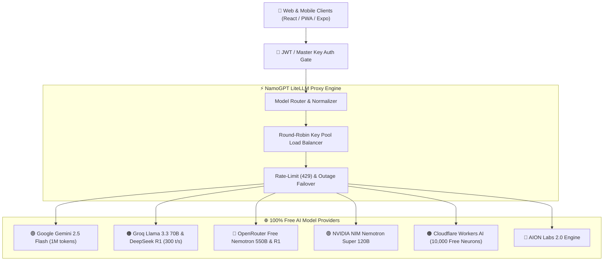

# 🔑 NamoGPT & LiteLLM Complete Setup & Key Provisioning Guide

> **Principal Engineering Reference**: A step-by-step master guide for configuring `LITELLM_MASTER_KEY`, obtaining Cloudflare Workers AI credentials (`CF_API_TOKEN` & `CF_ACCOUNT_ID`), provisioning all free model provider keys, and deploying with pre-seeded Super Admin credentials.

---

## 📑 Table of Contents

1. [Architectural Overview](#-architectural-overview)
2. [What is the LiteLLM Master Key & How to Generate It](#-1-what-is-litellm_master_key)
3. [How to Get Cloudflare Workers AI Token & Account ID](#-2-how-to-get-cf_api_token--cf_account_id)
4. [Step-by-Step Provisioning for All Free Model Keys](#-3-free-model-providers-step-by-step)
   - [Google Gemini 2.5 Flash](#google-gemini-google-ai-studio)
   - [Groq Cloud (Llama 3.3 70B & DeepSeek R1)](#groq-cloud)
   - [OpenRouter Free Tier (Nemotron 550B & DeepSeek R1)](#openrouter-free-tier)
   - [NVIDIA NIM (Nemotron 120B)](#nvidia-nim)
   - [AION Labs 2.0](#aion-labs)
5. [Key Rotation & Load-Balancing Strategy](#-4-key-rotation--pool-balancing)
6. [Super Admin Credentials & Admin Console](#-5-super-admin-credentials--console)
7. [Zero-Cost Cloud Deployment Guide](#-6-zero-cost-cloud-deployment)

---

## 🏛️ Architectural Overview



---

## 🛡️ 1. What is `LITELLM_MASTER_KEY`?

### What it is
The **LiteLLM Master Key** is an administrative secret bearer token that secures your proxy inference server. When configured:
- Public unauthorized callers cannot exhaust your free rate limits or quota.
- Your Web App, Mobile App, automated scripts, or curl requests authenticate using `Authorization: Bearer <LITELLM_MASTER_KEY>`.
- Any caller presenting this key is automatically granted **Super Admin** privileges on the proxy.

### How to Generate a Secure Master Key
Run either command in your terminal to generate a cryptographically secure random token:

**Using Node.js (Windows / Mac / Linux):**
```bash
node -e "console.log('sk-namo-' + require('crypto').randomBytes(24).toString('hex'))"
```
*Output sample:* `sk-namo-8f3a9e2c4d1b7a0f6e5d8c9b2a1f4e7d3c0b9a8f7e6d5c4b`

**Using OpenSSL (Linux / macOS):**
```bash
openssl rand -hex 24 | awk '{print "sk-namo-"$1}'
```

### How to Configure in `.env`
Add the generated key to your `.env` file:
```env
LITELLM_MASTER_KEY=sk-namo-8f3a9e2c4d1b7a0f6e5d8c9b2a1f4e7d3c0b9a8f7e6d5c4b
```
*(Note: If left blank, the server runs in development mode where client sessions authenticate via JWT).*

---

## ☁️ 2. How to Get `CF_API_TOKEN` & `CF_ACCOUNT_ID`

Cloudflare provides **Workers AI**, giving you **10,000 free neurons every single day forever** (equivalent to thousands of inference tokens on Llama 3.3 70B and BGE embeddings) at zero cost.

Follow these exact steps:

### Step 1: Create a Free Cloudflare Account
1. Open [dash.cloudflare.com/sign-up](https://dash.cloudflare.com/sign-up).
2. Enter your email and password (no credit card required).

### Step 2: Get Your `CF_ACCOUNT_ID`
1. Once logged in, click **Workers & Pages** in the left sidebar menu.
2. In the right-hand panel, locate the box titled **Account Details**.
3. Under **Account ID**, click **Click to copy** (it is a 32-character hexadecimal string, e.g. `6ebde4a7292d3b3dde4b09c98291f978`).
   - *Alternatively, copy it directly from your browser's address bar:*
     `https://dash.cloudflare.com/<ACCOUNT_ID>/workers-and-pages`
4. Put it in your `.env`:
   ```env
   CF_ACCOUNT_ID=6ebde4a7292d3b3dde4b09c98291f978
   ```

### Step 3: Create Your `CF_API_TOKEN`
1. Go directly to [dash.cloudflare.com/profile/api-tokens](https://dash.cloudflare.com/profile/api-tokens).
2. Click the blue **Create Token** button.
3. Scroll down to the template titled **Workers AI (Read and Write)** and click **Use template**.
   *(Or click "Create Custom Token" at the bottom)*.
4. If configuring permissions manually:
   - **Token name**: `NamoGPT Workers AI Token`
   - **Permissions**:
     - `Account` → `Workers AI` → `Edit`
     - `Account` → `Workers AI` → `Read`
   - **Account Resources**:
     - `Include` → `All Accounts` (or select your account)
5. Click **Continue to summary** at the bottom.
6. Click **Create Token**.
7. Copy the generated token string (e.g. `v4.0.0-xxxx...`). **Note: Cloudflare only displays this token once!**
8. Put it in your `.env`:
   ```env
   CF_API_TOKEN=your_copied_cloudflare_token_here
   ```

---

## 🌐 3. Free Model Providers Step-by-Step

All providers below offer **100% free tiers** with no credit card required.

---

### Google Gemini (Google AI Studio)
- **Model**: `gemini-2.5-flash`
- **Capabilities**: 1,048,576 token context window, multimodal vision, coding, reasoning.
- **Free Limit**: 15 Requests Per Minute (RPM), 1,500 Requests Per Day (RPD).
- **How to Get Key**:
  1. Go to [aistudio.google.com/apikey](https://aistudio.google.com/apikey).
  2. Sign in with your Google account.
  3. Click **Create API key** → select a Google Cloud project (or create default).
  4. Copy key (`AIzaSy...`).
- **Configure in `.env`**:
  ```env
  GEMINI_API_KEY_1=AIzaSy...
  GEMINI_API_KEY_2=AIzaSy...   # Optional: 2nd key from another Google account
  ```

---

### Groq Cloud
- **Models**: `llama-3.3-70b-versatile`, `deepseek-r1-distill-llama-70b`, `llama-3.1-8b-instant`.
- **Capabilities**: World's fastest inference (~300 to 750 tokens/sec) on Groq LPUs.
- **Free Limit**: 30 Requests Per Minute (RPM), 14,400 Requests Per Day.
- **How to Get Key**:
  1. Go to [console.groq.com/keys](https://console.groq.com/keys).
  2. Sign in with GitHub or Google.
  3. Click **Create API Key**.
  4. Copy key (`gsk_...`).
- **Configure in `.env`**:
  ```env
  GROQ_API_KEY_1=gsk_...
  GROQ_API_KEY_2=gsk_...       # Optional: key rotation pool
  ```

---

### OpenRouter Free Tier
- **Models**: `nvidia/nemotron-3-ultra-550b-a55b:free`, `deepseek/deepseek-r1:free`.
- **Capabilities**: Massive 550-billion parameter model and full DeepSeek R1 reasoning at zero cost.
- **Free Limit**: 20 Requests Per Minute (RPM), 200 Requests Per Day.
- **How to Get Key**:
  1. Go to [openrouter.ai/keys](https://openrouter.ai/keys).
  2. Sign in with Google or GitHub.
  3. Click **Create Key**.
  4. Copy key (`sk-or-v1-...`).
- **Configure in `.env`**:
  ```env
  OPEN_ROUTER_API_KEY_1=sk-or-v1-...
  OPEN_ROUTER_API_KEY_2=sk-or-v1-...
  ```

---

### NVIDIA NIM
- **Model**: `nvidia/nemotron-3-super-120b-a12b`.
- **Capabilities**: Enterprise accelerated reasoning engine hosted directly by NVIDIA.
- **Free Limit**: 1,000 free GPU credits upon registration.
- **How to Get Key**:
  1. Go to [build.nvidia.com](https://build.nvidia.com).
  2. Sign up with email.
  3. Navigate to **API Keys** and generate a token (`nvapi-...`).
- **Configure in `.env`**:
  ```env
  NVIDIA_NIM_API_KEY_1=nvapi-...
  ```

---

### AION Labs
- **Model**: `aion-labs/aion-2.0`.
- **Configure in `.env`**:
  ```env
  AION_API_KEY_1=your_aion_key_here
  ```

---

## 🔄 4. Key Rotation & Pool Balancing

NamoGPT's proxy features **intelligent round-robin load balancing** and **automatic failover**.

If you configure multiple keys from different accounts for a provider (e.g., `GEMINI_API_KEY_1`, `GEMINI_API_KEY_2`, `GEMINI_API_KEY_3`):
1. **Traffic Distribution**: Requests are balanced round-robin across your keys.
2. **Quota Multiplication**: 3 Google accounts with 15 RPM each give you an aggregate **45 RPM** completely free!
3. **Resilient Failover**: If Key #1 hits a 429 rate-limit, the proxy automatically fails over to Key #2 without dropping the client stream.
4. **Resilient Variable Resolution**: The proxy accepts both indexed variables (`GEMINI_API_KEY_1`) and single unindexed variables (`GEMINI_API_KEY`), so any format you put in `.env` works immediately.

---

## 👑 5. Super Admin Credentials & Console

When you launch or deploy NamoGPT, the system automatically initializes a pre-seeded **Super Admin** account:

| Attribute | Default Value | Environment Override |
| :--- | :--- | :--- |
| **Email** | `admin@namogpt.com` | `ADMIN_EMAIL` |
| **Password** | `Admin@NamoGPT2026!` | `ADMIN_PASSWORD` |
| **Role** | `superadmin` | `superadmin` |
| **Name** | `Super Admin` | `ADMIN_NAME` |

### What Super Admin Unlocks
1. **Run All Models from `.env` Keys**: Log in with Super Admin credentials, and you can chat with any configured model immediately without pasting keys into client settings.
2. **Super Admin Console**: Click the gold **👑 Super Admin** badge in the header or sidebar to open the telemetry modal:
   - **Key Inspector**: Shows exactly which keys in `.env` are detected, active, and loaded.
   - **Server Health**: Real-time memory consumption, uptime, and platform metrics.
   - **User Directory**: View all registered accounts on your deployed instance.
3. **1-Click Demo Login**: The web and mobile login screens include a prominent **"1-Click Login as Super Admin"** button for quick access during testing and presentation.

---

## 🚀 6. Zero-Cost Cloud Deployment

### 1-Click Deployment on Render.com (Recommended Free Fullstack)

Render provides free hosting for unified Node.js applications with zero configuration.

1. **Push your code to GitHub**:
   ```bash
   git push origin main
   ```
2. **Create New Web Service on Render**:
   - Go to [dashboard.render.com](https://dashboard.render.com) → click **New +** → **Web Service**.
   - Select your GitHub repository: `Rohit-Jigar/NamoGPT`.
3. **Configure Build & Start Commands**:
   - **Environment**: `Node`
   - **Build Command**:
     ```bash
     npm run build
     ```
     *(This installs dependencies and compiles the Vite web app to `web/dist`)*
   - **Start Command**:
     ```bash
     npm start
     ```
     *(Runs `node server/server.js` on port 3001, serving both the API and Web UI)*
4. **Set Environment Variables on Render**:
   In the Render dashboard under **Environment**, add:
   ```env
   NODE_ENV=production
   ADMIN_EMAIL=admin@namogpt.com
   ADMIN_PASSWORD=Admin@NamoGPT2026!
   GEMINI_API_KEY_1=your_gemini_key
   GROQ_API_KEY_1=your_groq_key
   CF_API_TOKEN=your_cloudflare_token
   CF_ACCOUNT_ID=your_cloudflare_account_id
   OPEN_ROUTER_API_KEY_1=your_openrouter_key
   NVIDIA_NIM_API_KEY_1=your_nvidia_key
   ```
5. **Click "Create Web Service"**:
   Render will deploy your fullstack app. Within 2 minutes, you will receive a live URL:
   ```
   https://namogpt-xxxx.onrender.com
   ```
6. **Open the Live App**:
   - Click **Sign In** → click **1-Click Login as Super Admin**.
   - You can now chat with any model using the API keys you set in the Render environment!
