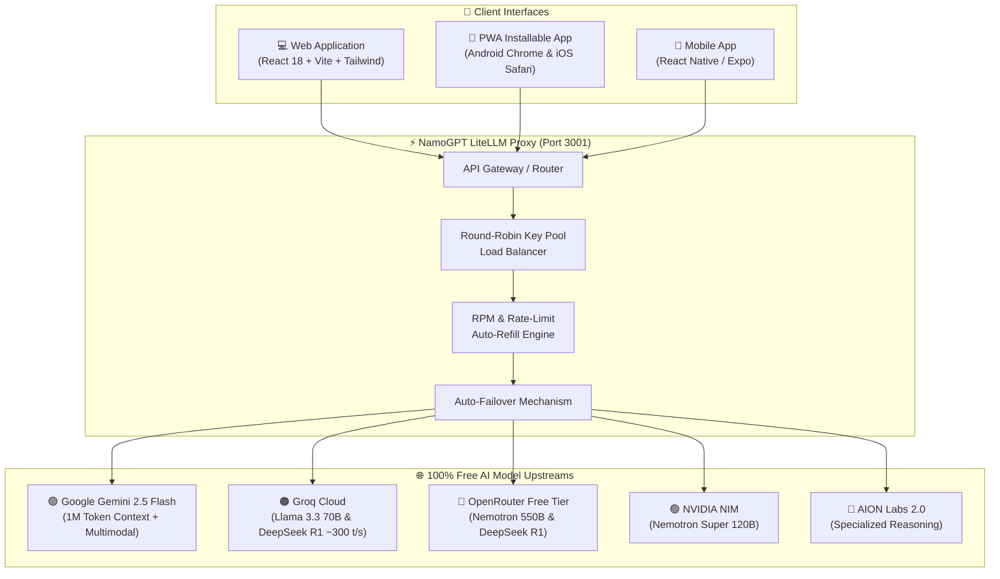

# 🌟 NamoGPT

> **Full-featured, multi-model ChatGPT alternative powered by an intelligent LiteLLM Proxy with automatic key rotation, rate-limit failover, and support for all free state-of-the-art AI models across Web, Android, and iOS.**


---

## 🏛️ Architecture Overview



---

## ✨ Features

- **🎨 Authentic ChatGPT Design**: Pixel-perfect dark & light mode interface inspired by ChatGPT with sleek typography, responsive sidebar, and glowing emerald accents.
- **🔄 Multi-Model Switcher**: Switch between Gemini 2.5 Flash, Groq Llama 3.3 70B, DeepSeek R1 Distill, Nemotron 550B, and NVIDIA 120B on the fly.
- **⚡ Ultra-Low Latency Streaming**: Full Server-Sent Events (SSE) token streaming with typing animation and generation stop control.
- **📱 Run Anywhere (Web, Android & iPhone)**:
  - **PWA (Progressive Web App)**: Install instantly on any iPhone ("Add to Home Screen") or Android device ("Install App") for a native, fullscreen app experience.
  - **React Native / Expo**: Full cross-platform mobile codebase in `mobile/` ready for native APK and iOS IPA compilation.
- **🧠 Chain-of-Thought Reasoning**: Collapsible thought blocks for DeepSeek R1 and reasoning models.
- **💻 Rich Markdown & Code Blocks**: Code syntax highlighting, copy-code button, language tags, tables, and LaTeX math equations ($E=mc^2$).
- **🎙️ Voice Dictation & Text-to-Speech**: Speech-to-text mic input with Web Speech API and text-to-speech voice read-aloud.
- **📎 Multimodal Attachments**: Image and document upload preview support.
- **🔑 Dynamic Key Pooling**: Supports multi-key load balancing per provider in `config.yaml` or directly in the UI Settings modal.
- **📤 Export Chats**: Export any conversation to Markdown (.md), JSON, or plain text (.txt).

---

## 🚀 Free AI Models Supported

| Model Name | Upstream Provider | Parameter Scale | Speed | Strengths |
| :--- | :--- | :--- | :--- | :--- |
| **Gemini 2.5 Flash** | Google AI Studio | SOTA MoE | ⚡⚡⚡ Fast | 1,048,576 Token Context, Vision, Code |
| **Llama 3.3 70B** | Groq Cloud | 70 Billion | ⚡⚡⚡⚡⚡ ~300 t/s | Near-instant responses, general chat |
| **DeepSeek R1 Distill** | Groq Cloud | 70 Billion | ⚡⚡⚡⚡ ~250 t/s | Mathematical, logical reasoning |
| **Llama 3.1 8B Instant** | Groq Cloud | 8 Billion | ⚡⚡⚡⚡⚡ ~750 t/s | Ultra-low latency quick replies |
| **Nemotron 3 Ultra** | OpenRouter (Free) | 550 Billion | ⚡⚡ Medium | Open architecture, tool calling |
| **DeepSeek R1 Free** | OpenRouter (Free) | Flagship 671B | ⚡ Steady | Uncensored full reasoning |
| **Nemotron Super 120B**| NVIDIA NIM | 120 Billion | ⚡⚡⚡ Fast | Accelerated enterprise STEM models |
| **AION 2.0** | AION Labs | Specialized | ⚡⚡ Medium | Complex instructional adherence |

---

## 🛠️ Quick Start

### 1. Prerequisites
- **Node.js** v18+ or v20+
- **npm** v9+

### 2. Clone and Install
```bash
git clone https://github.com/Rohit-Jigar/NamoGPT.git
cd NamoGPT

# Install all dependencies (root, server, and web)
npm run install:all
```

### 3. Configure API Keys
Copy `.env.example` to `.env`:
```bash
cp .env.example .env
```
*(Or enter your keys directly in the NamoGPT web UI via **Settings ⚙️**)*.

Get your 100% free keys:
- **Google Gemini**: [aistudio.google.com/apikey](https://aistudio.google.com/apikey)
- **Groq Cloud**: [console.groq.com/keys](https://console.groq.com/keys)
- **OpenRouter**: [openrouter.ai/keys](https://openrouter.ai/keys)
- **NVIDIA NIM**: [build.nvidia.com](https://build.nvidia.com)

### 4. Run Locally
```bash
# Starts both the LiteLLM Proxy (port 3001) and Web UI (port 5173)
npm run dev
```

Open your browser to:
- **Web App**: `http://localhost:5173`
- **LiteLLM Server & Swagger Docs**: `http://localhost:3001/docs`

---

## 🌐 100% Free Cloud Deployment Guide

Want to deploy NamoGPT to the cloud for free with $0.00/month hosting?
👉 **Read the full [100% Free Deployment Guide](DEPLOYMENT_GUIDE.md)**

- **Vercel** (Serverless proxy + global frontend)
- **Render** (Continuous fullstack Node.js server)
- **Netlify & Cloudflare Pages**
- **iOS & Android PWA** and **Expo Mobile App**

---

## 📱 Running on Android & iPhone

### Option A: Progressive Web App (Zero Install Required)
1. Open `http://<YOUR_IP>:3001` or your deployed URL in Chrome (Android) or Safari (iOS).
2. Tap the share / menu button.
3. Tap **"Add to Home Screen"** or **"Install App"**.
4. NamoGPT will launch as a standalone, fullscreen mobile application with icon and offline capabilities.

### Option B: React Native / Expo Mobile App
```bash
cd mobile
npm install
npx expo start
```
- Scan the QR code using **Expo Go** on Android or iOS.
- Or build native binaries via EAS:
  ```bash
  eas build -p android --profile preview
  eas build -p ios --profile preview
  ```

---

## 📂 Repository Structure

```
NamoGPT/
├── config.yaml          # LiteLLM model routing, load balancing & failover pools
├── .env.example         # Template for all provider API keys
├── package.json         # Monorepo scripts
│
├── server/              # LiteLLM Proxy & NamoGPT Backend API
│   ├── server.js        # Express server with CORS & static UI serving
│   ├── models-metadata.js # Model catalog & capability flags
│   ├── api/
│   │   ├── index.js     # OpenAI-compatible /v1/chat/completions router
│   │   └── anthropic_adaptions.js # Anthropic /v1/messages router
│   └── openapi.js       # Swagger OpenAPI specifications
│
├── web/                 # NamoGPT Web & PWA (ChatGPT-grade UI)
│   ├── src/
│   │   ├── components/  # Sidebar, Header, ChatArea, ChatInput, SettingsModal, ExportModal
│   │   ├── context/     # State management, persistence & SSE streaming
│   │   └── services/    # Client API service
│   ├── public/          # PWA manifest.json, sw.js, and logo.svg
│   └── vite.config.js
│
└── mobile/              # React Native Expo Application (Android & iOS)
    ├── App.js           # Mobile application root
    ├── app.json         # Expo mobile configuration
    └── src/
```

---

## 📄 License

MIT © [Rohit-Jigar](https://github.com/Rohit-Jigar)
