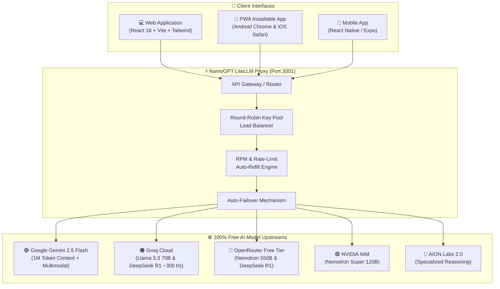

# 🌟 NamoGPT

> **Full-featured, multi-model ChatGPT alternative powered by an intelligent LiteLLM Proxy with automatic key rotation, rate-limit failover, and support for all free state-of-the-art AI models across Web, Android, and iOS.**


---

## 🏛️ Architecture Overview



---

## ✨ Features

- **🎨 Authentic ChatGPT Design**: Pixel-perfect dark & light mode interface inspired by ChatGPT with sleek typography, responsive sidebar, and glowing emerald accents.
- **🔄 Multi-Model Switcher**: Switch between Gemini 2.5 Flash, Groq Llama 3.3 70B, DeepSeek R1 Distill, Nemotron 550B, and NVIDIA 120B on the fly.
- **⚡ Ultra-Low Latency Streaming**: Full Server-Sent Events (SSE) token streaming with typing animation and generation stop control.
- **📱 Run Anywhere (Web, Android & iPhone)**:
  - **PWA (Progressive Web App)**: Install instantly on any iPhone ("Add to Home Screen") or Android device ("Install App") for a native, fullscreen app experience.
  - **React Native / Expo**: Full cross-platform mobile codebase in `mobile/` ready for native APK and iOS IPA compilation.
- **🌐 Real-Time Web Search**: Zero API key required! Real-time internet retrieval via DuckDuckGo and Wikipedia with live search source carousels and clickable citations.
- **👁️ Free Vision & Multimodal Processing**: Analyze photos, diagrams, architecture charts, and OCR receipts using Gemini 2.5 Flash (1M tokens) and Groq Llama 3.2 90B Vision.
- **🧠 Thinking Mode & Chain-of-Thought**: DeepSeek R1 reasoning with collapsible thought accordion showing step-by-step logic.
- **⚡ Code Interpreter & Sandbox Runner**: Run JavaScript (Node.js isolated VM) and Python code right inside the chat window with real-time terminal output, exit codes, and execution timers.
- **📑 Document Intelligence & RAG Engine**: Upload `.csv`, `.pdf`, `.txt`, `.md`, `.json` files. In-memory Okapi BM25 similarity scoring, overlapping text chunking, and structured CSV tabular parsing.
- **🧭 Autonomous Deep Research Mode**: Decomposes complex topics into parallel research vectors, queries real-time web sources, cross-checks findings, and synthesizes comprehensive research dossiers.
- **💾 Long-Term Memory**: Remembers user preferences, coding styles, and facts across conversations with automatic pattern detection ("Remember that I use...") and semantic recall.
- **🤖 AI Personas & Custom GPTs**: Switch between Software Architect, Academic Researcher, Financial Analyst, Socratic Tutor, Senior Data Scientist, or create your own custom AI personas.
- **🔀 9Router & OmniRouter Integration**: Universal local bridge (port `20128`) connecting NamoGPT to 60+ upstream providers with live ping tests.
- **🔐 Built-in Authentication & Super Admin Console**:
  - Full user registration and JWT authentication system.
  - Pre-seeded **Super Admin** account (`admin@namogpt.com` / `Admin@NamoGPT2026!`) for immediate deployment evaluation.
  - Interactive Admin Console displaying live `.env` key detection status, server uptime, and user directory.
- **📱 True Cross-Device Responsiveness**:
  - PWA installable on iOS and Android with fullscreen native feel.
  - Responsive layout across phones, tablets, and desktops (`100dvh` viewport).
- **🎙️ Voice Dictation & Text-to-Speech**: Speech-to-text mic input with Web Speech API and text-to-speech voice read-aloud.
- **📤 Export Chats**: Export any conversation to Markdown (.md), JSON, or plain text (.txt).

---

## 🚀 Free AI Models Supported

| Model Name | Upstream Provider | Parameter Scale | Speed | Strengths |
| :--- | :--- | :--- | :--- | :--- |
| **Gemini 2.5 Flash** | Google AI Studio | SOTA MoE | ⚡⚡⚡ Fast | 1,048,576 Context, Vision, Code, Free Tier |
| **Llama 3.2 90B Vision** | Groq Cloud | 90 Billion | ⚡⚡⚡⚡ ~250 t/s | Free multimodal vision, diagram OCR |
| **DeepSeek R1 Distill** | Groq Cloud | 70 Billion | ⚡⚡⚡⚡ ~250 t/s | Mathematical, logical reasoning & thoughts |
| **Llama 3.3 70B** | Groq Cloud | 70 Billion | ⚡⚡⚡⚡⚡ ~300 t/s | Ultra-fast open intelligence |
| **Nemotron 3.5 Lightning** | OpenRouter (Free) | 550 Billion | ⚡⚡ Medium | Open architecture, tool calling |
| **Nemotron Super 120B**| NVIDIA NIM | 120 Billion | ⚡⚡⚡ Fast | Accelerated enterprise STEM models |
| **9Router Bridge** | Local 9Router (20128) | Multi-Model | ⚡⚡⚡ Fast | Smart fallback & 40+ providers |
| **OmniRouter Bridge** | OmniRoute (20128) | Multi-Model | ⚡⚡⚡ Fast | 60+ upstream provider gateway |

---

## 🔑 Where to Get 100% Free API Keys

All services below have generous free tiers with zero credit card required:
- **Google Gemini**: [aistudio.google.com/apikey](https://aistudio.google.com/apikey) *(Free 1M token context & vision)*
- **Groq Cloud**: [console.groq.com/keys](https://console.groq.com/keys) *(Free ~300 t/s Llama 3.3, Llama 3.2 Vision, DeepSeek R1)*
- **OpenRouter (Free)**: [openrouter.ai/keys](https://openrouter.ai/keys) *(Free public models tagged `:free`)*
- **NVIDIA NIM**: [build.nvidia.com](https://build.nvidia.com) *(1,000 free API credits for Nemotron models)*
- **Cloudflare Workers AI**: [dash.cloudflare.com](https://dash.cloudflare.com) *(10,000 free neurons daily)*
- **9Router / OmniRouter**: [github.com/diegosouzapw/OmniRoute](https://github.com/diegosouzapw/OmniRoute) *(Open-source AI router on localhost:20128)*

---

## 🛠️ Quick Start

### 1. Prerequisites
- **Node.js** v18+ or v20+
- **npm** v9+

### 2. Clone and Install
```bash
git clone https://github.com/Rohit-Jigar/NamoGPT.git
cd NamoGPT

# Install all dependencies (root, server, and web)
npm run install:all
```

### 3. Configure API Keys
Copy `.env.example` to `.env`:
```bash
cp .env.example .env
```
*(Or enter your keys directly in the NamoGPT web UI via **Settings ⚙️**)*.
- **OpenRouter**: [openrouter.ai/keys](https://openrouter.ai/keys)
- **NVIDIA NIM**: [build.nvidia.com](https://build.nvidia.com)

### 4. Run Locally
```bash
# Starts both the LiteLLM Proxy (port 3001) and Web UI (port 5173)
npm run dev
```

Open your browser to:
- **Web App**: `http://localhost:5173`
- **LiteLLM Server & Swagger Docs**: `http://localhost:3001/docs`

---

## 🌐 100% Free Cloud Deployment Guide

Want to deploy NamoGPT to the cloud for free with $0.00/month hosting?
👉 **Read the full [100% Free Deployment Guide](FREE_DEPLOYMENT_GUIDE.md)** (or [DEPLOYMENT_GUIDE.md](DEPLOYMENT_GUIDE.md))

- **Vercel** (Serverless proxy + global frontend)
- **Render** (Continuous fullstack Node.js server)
- **Netlify & Cloudflare Pages**
- **iOS & Android PWA** and **Expo Mobile App**

---

## 📱 Running on Android & iPhone

### Option A: Progressive Web App (Zero Install Required)
1. Open `http://<YOUR_IP>:3001` or your deployed URL in Chrome (Android) or Safari (iOS).
2. Tap the share / menu button.
3. Tap **"Add to Home Screen"** or **"Install App"**.
4. NamoGPT will launch as a standalone, fullscreen mobile application with icon and offline capabilities.

### Option B: React Native / Expo Mobile App
```bash
cd mobile
npm install
npx expo start
```
- Scan the QR code using **Expo Go** on Android or iOS.
- Or build native binaries via EAS:
  ```bash
  eas build -p android --profile preview
  eas build -p ios --profile preview
  ```

---

## 🚀 Free Deployment, LiteLLM Setup & CI/CD

- 🔑 **LiteLLM Setup & Free API Keys Guide**: [`LITELLM_SETUP_GUIDE.md`](LITELLM_SETUP_GUIDE.md) (covers `LITELLM_MASTER_KEY`, Cloudflare Workers AI `CF_API_TOKEN` & Account ID, Gemini, Groq, OpenRouter, and NVIDIA NIM setup)
- 📖 **Complete 100% Free Deployment Guide**: [`FREE_DEPLOYMENT_GUIDE.md`](FREE_DEPLOYMENT_GUIDE.md) (covers Render, Vercel, GitHub Pages, Android APK, and iOS)
- 🔄 **Automated CI/CD Pipeline Guide**: [`CI_CD_PIPELINE.md`](CI_CD_PIPELINE.md) (covers GitHub Actions matrix testing, linters, and auto-deploy)

### 👑 Pre-Seeded Super Admin Credentials
For testing and immediate deployment evaluation:
- **Email**: `admin@namogpt.com` *(or set via `ADMIN_EMAIL` in `.env`)*
- **Password**: `Admin@NamoGPT2026!` *(or set via `ADMIN_PASSWORD` in `.env`)*
- **Role**: `superadmin`
- **1-Click Login**: Simply click **"1-Click Login as Super Admin"** on the Sign In page.


---

## 📂 Repository Structure

```
NamoGPT/
├── config.yaml          # LiteLLM model routing, load balancing & failover pools
├── .env.example         # Template for all provider API keys
├── package.json         # Monorepo scripts
│
├── server/              # LiteLLM Proxy & NamoGPT Backend API
│   ├── server.js        # Express server with CORS & static UI serving
│   ├── models-metadata.js # Model catalog & capability flags
│   ├── api/
│   │   ├── index.js     # OpenAI-compatible /v1/chat/completions router
│   │   └── anthropic_adaptions.js # Anthropic /v1/messages router
│   └── openapi.js       # Swagger OpenAPI specifications
│
├── web/                 # NamoGPT Web & PWA (ChatGPT-grade UI)
│   ├── src/
│   │   ├── components/  # Sidebar, Header, ChatArea, ChatInput, SettingsModal, ExportModal
│   │   ├── context/     # State management, persistence & SSE streaming
│   │   └── services/    # Client API service
│   ├── public/          # PWA manifest.json, sw.js, and logo.svg
│   └── vite.config.js
│
└── mobile/              # React Native Expo Application (Android & iOS)
    ├── App.js           # Mobile application root
    ├── app.json         # Expo mobile configuration
    └── src/
```

---

## 📄 License

MIT © [Rohit-Jigar](https://github.com/Rohit-Jigar)
